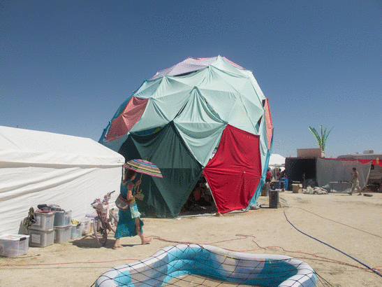

# Jenny's Shady Waffle Ellipitical Dome Calculator

This code will allow you to generate a geodesic dome. It was designed for Shady Waffle's 2014 dome. 

You can create a standard dome or an elliptical one by specifying 2 different axis lengths.

### Contents

- [Environment Setup](#setup)
- [Getting Started](#start)
    - [View the Shady Dome](#shady)
    - [Running the tests](#testing)
- [Create your dome](#create)
- [Contributing](#contrib)

#  Environment Setup

This calculator runs using [Clojure](http://clojure.org/). 

On OS X you can install [Leiningin](http://leiningen.org/) with Brew. On other platforms, see the Leiningin instructions.

        $ brew install leiningen

#  Getting started

Once you have Clojure launch the repl.

        $ lein repl

Verify that you can see the dome contents with the following. If it returns `nil`, it worked. You will get a `FileNotFoundException` if the dome code can't be found.

        user=> (require 'dome.core)
        nil

## View the Shady Dome

        user=> (pprint (dome.core/the-shady-waffle-dome))
        {:radius-1 16,
         :radius-2 25.888544,
         :num-conduit-pieces-to-buy 337,
         :num-struts 425,
         :num-spares 1,
         :num-distinct-lengths 37,
         :struts
         ({:id 0,
           :length 3.195695,
           :count 5,
           :struts ((3.195695 [0 0] [1 0]) (3.195695 [0 0] [1 1]))}
        ...
        :cuts
         [({:id 36, :length 6.9088874})
          ({:id 36, :length 6.9088874})
          ({:id 36, :length 6.9088874})
          ({:id 36, :length 6.9088874})
        ...
          ({:id 12, :length 4.939847} {:id 12, :length 4.939847})]}

##  Running the tests

Verify that you have the test code.

        user=> (require 'dome.core-test)
        nil

Now run the tests

        user=> (pprint (dome.core-test/consolidate-struts-test))
        425
        nil
        nil

#  Create your own dome

To create your own dome, you will need to specify the two radii, your cut tolerance, the number of Vs. You can see from the Shady Waffle dome example the settings for the Shady dome.

          (let [{:keys [struts cuts]} (icosa-struts 5 16 1 0.2 (/ 0.125 12.0))
        no-extra-struts (icosa-struts 5 16 0 0.3 0.0075)
        conduit-length (->> no-extra-struts :cuts (mapcat (partial map :length)) (apply +))

You can optionally output the conduit cuts & strut information to CSV with the following.

        cut-filename (format "%s-cuts.csv" file-base)
        strut-filename (format "%s-struts.csv" file-base)]

#  Contributing

The output of this was manually translated into the construction diagram. The next step for this project is to create a way to automatically generate the construction diagram. This is left as an exercise for the reader. Pull requests are accepted.
